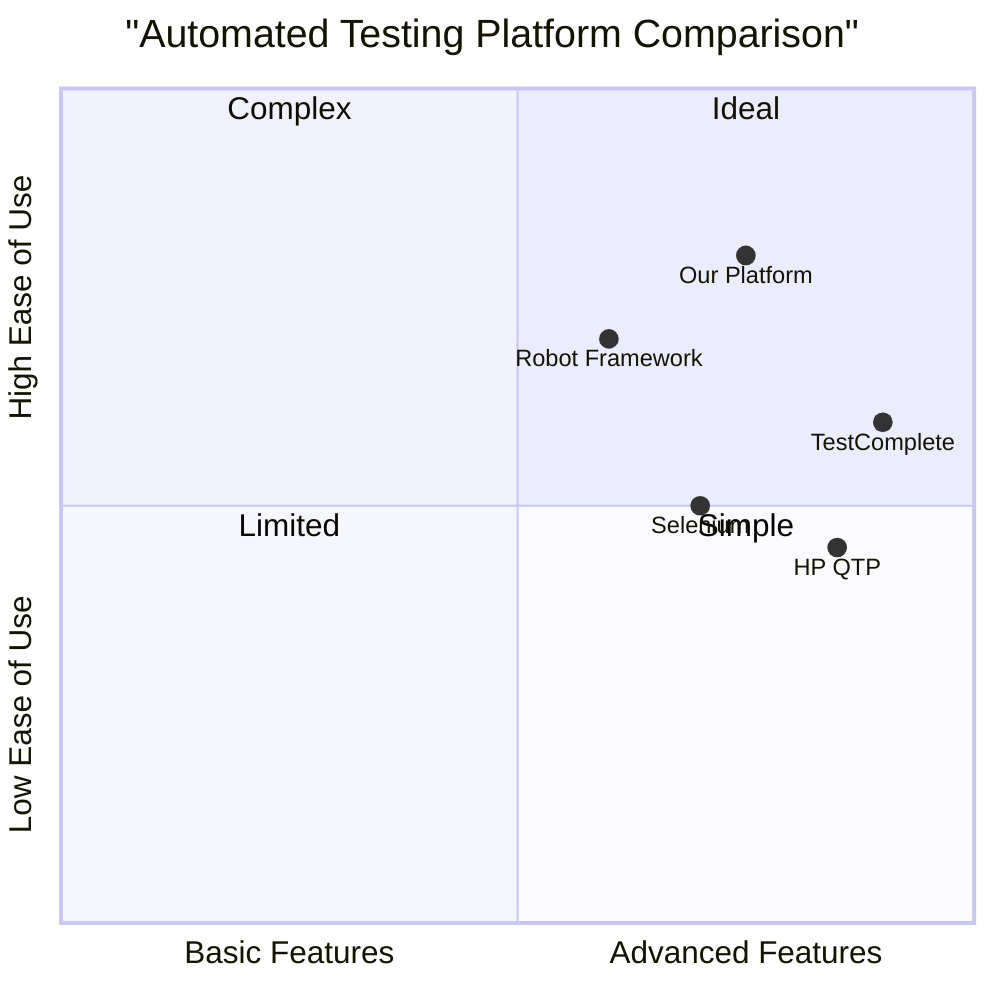

# Softswitch System Automated Testing Platform PRD

## 1. Product Overview

### 1.1 Project Information
- Product Name: Softswitch System Automated Testing Platform
- Language: Python
- Architecture: Client/Server (C/S)

### 1.2 Product Goals
1. Automate softswitch system testing to reduce manual effort by 80%
2. Improve test coverage to achieve 95% functionality coverage
3. Reduce overall test execution time by 50%

### 1.3 User Stories
1. As a test engineer, I want to create and manage test cases easily so I can maintain organized test suites
2. As a QA manager, I want to monitor test execution in real-time so I can track testing progress
3. As a test analyst, I want automated test reports so I can quickly analyze results

## 2. Functional Requirements

### 2.1 Test Case Management (P0)
- Create, edit and delete test cases
- Import/export test cases (XML, JSON)
- Organize test cases into suites
- Version control for test cases
- Search and filter functionality

### 2.2 Test Execution Control (P0)
- Single test case execution
- Test suite batch execution
- Pause/Resume/Stop controls
- Real-time execution monitoring
- Concurrent test execution

### 2.3 Test Result Management (P0)
- Real-time result display
- Automated report generation
- Result storage and retrieval
- Pass/Fail statistics
- Error logging

### 2.4 System Configuration (P0)
- Test environment setup
- Protocol configurations
- User access control
- System parameters

## 3. Technical Requirements

### 3.1 Architecture
- C/S architecture
- RESTful API
- Modular design

### 3.2 Technology Stack
- Backend: Python
- Database: MySQL
- UI: PyQt5
- Test Framework: PyUnit

### 3.3 Supported Protocols
- SIP
- ISUP
- ISDN

## 4. Performance Requirements

### 4.1 Response Time
- UI operation response < 1s
- Database query response < 2s

### 4.2 Concurrency
- Support 100+ concurrent test cases
- Handle 50+ simultaneous users

### 4.3 Stability
- 24/7 operation capability
- 99.9% system availability

## 5. UI Design Draft

### 5.1 Main Dashboard
```
+------------------------+
|     Dashboard Menu     |
+------------------------+
|   Test Execution       |
|   Status Overview      |
+------------------------+
|   Recent Results       |
|   Quick Actions        |
+------------------------+
```

### 5.2 Test Management
```
+------------------------+
|  Test Case Tree    |   |
|  - Suite 1         | D |
|    - Case 1.1      | e |
|    - Case 1.2      | t |
|  - Suite 2         | a |
|    - Case 2.1      | i |
|                    | l |
+------------------------+
```

## 6. Competitive Analysis



## 7. Open Questions

1. How to handle protocol version compatibility?
2. What is the backup strategy for test results?
3. How to ensure data consistency in concurrent testing?

## 8. Timeline

Phase 1 (3 months):
- Basic test management
- Simple execution
- Basic reporting

Phase 2 (3 months):
- Advanced execution
- Enhanced reporting
- Configuration management

Phase 3 (2 months):
- Performance optimization
- Advanced analytics